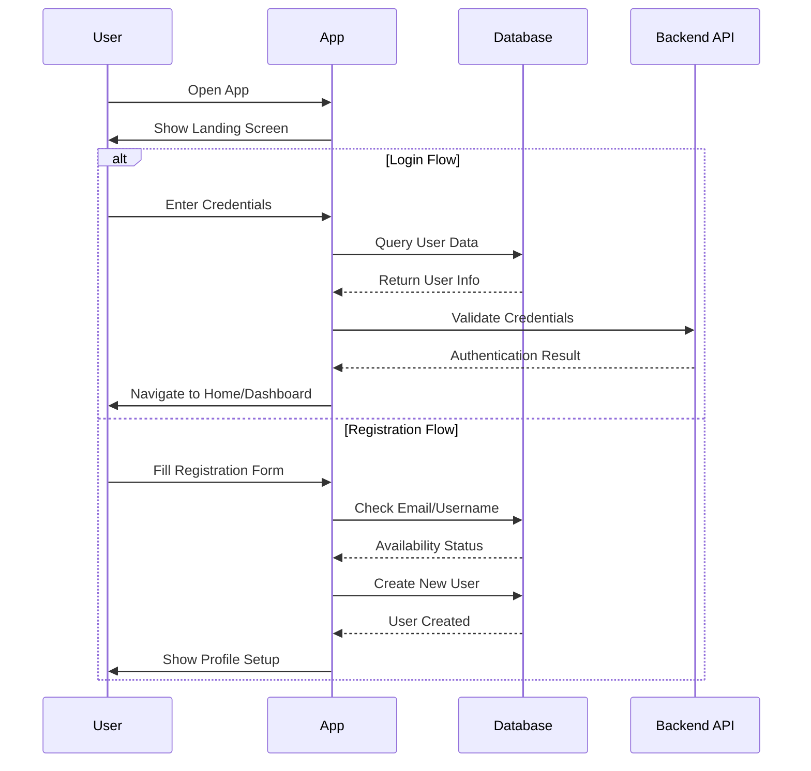
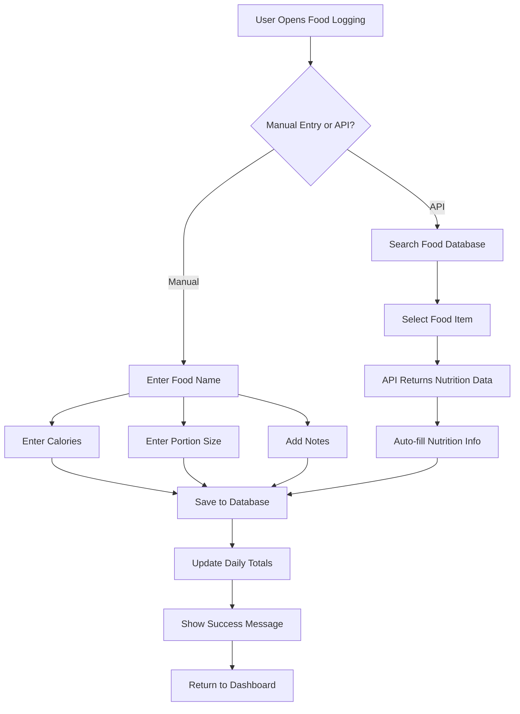
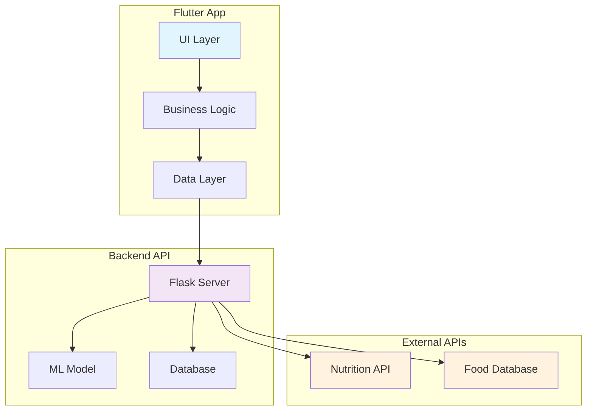
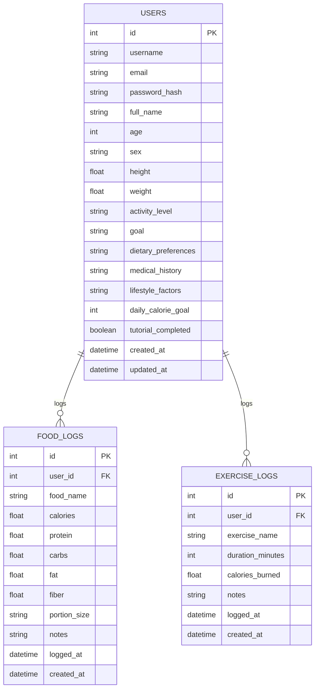
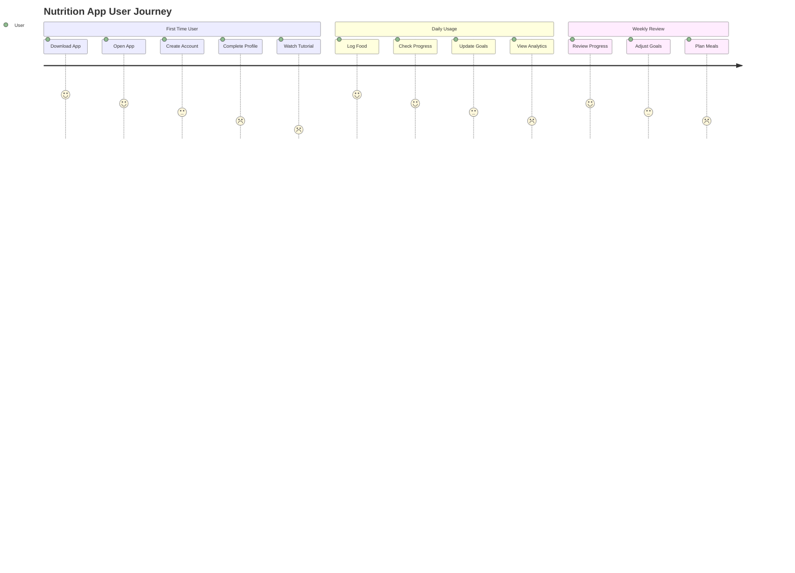
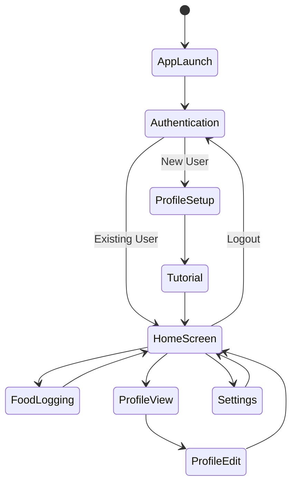
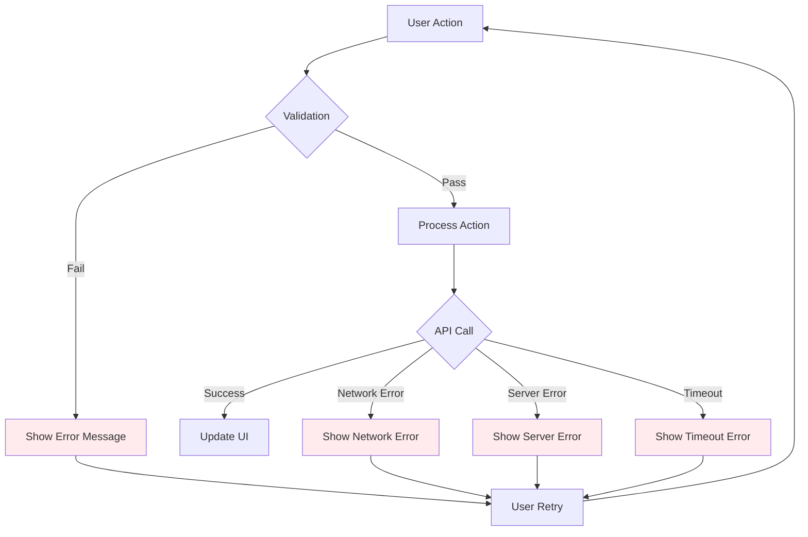
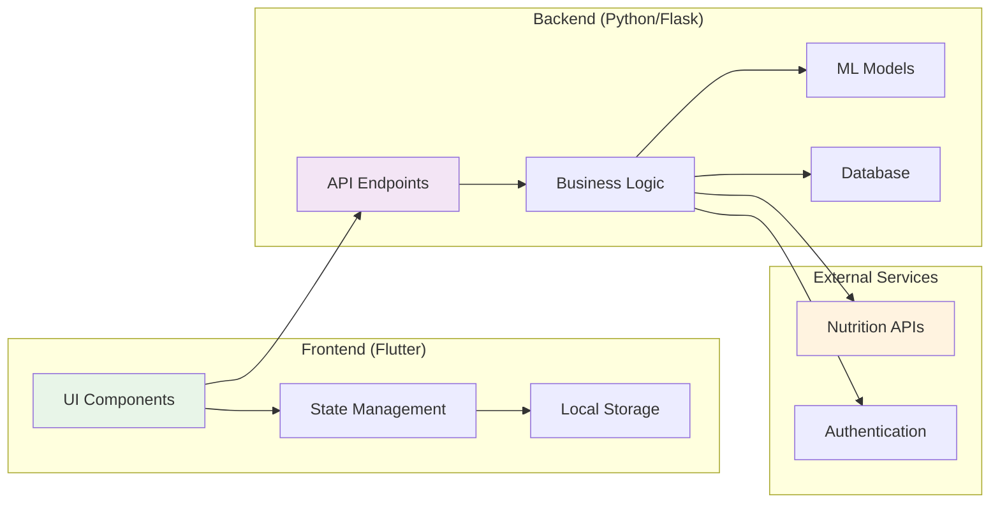
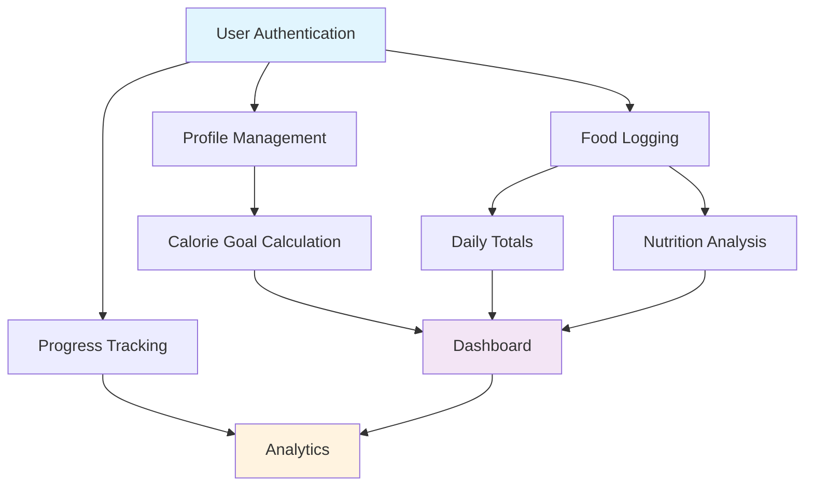
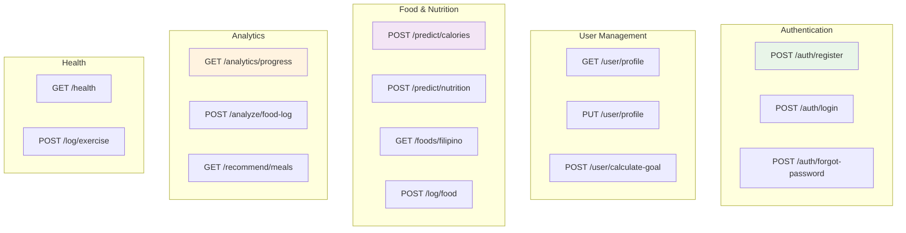

# Mermaid Diagrams for Nutrition App

## 1. User Authentication Sequence Diagram



## 2. Food Logging Process Flow



## 3. API Integration Architecture



## 4. Database Schema Diagram



## 5. User Journey Flow



## 6. State Management Flow



## 7. Error Handling Flow



## 8. Data Flow Architecture



## 9. Feature Dependency Graph



## 10. API Endpoint Structure



## Usage Instructions

To use these Mermaid diagrams:

1. **Copy the code** between the ```mermaid blocks
2. **Paste into** any Mermaid-compatible editor:
   - GitHub (in markdown files)
   - GitLab
   - Notion
   - Mermaid Live Editor (https://mermaid.live)
   - VS Code with Mermaid extension

3. **Customize** the diagrams by:
   - Changing colors (style fill:#color)
   - Adding/modifying nodes and connections
   - Updating text and labels
   - Adjusting layout and flow

4. **Export** as PNG, SVG, or PDF from the Mermaid Live Editor 