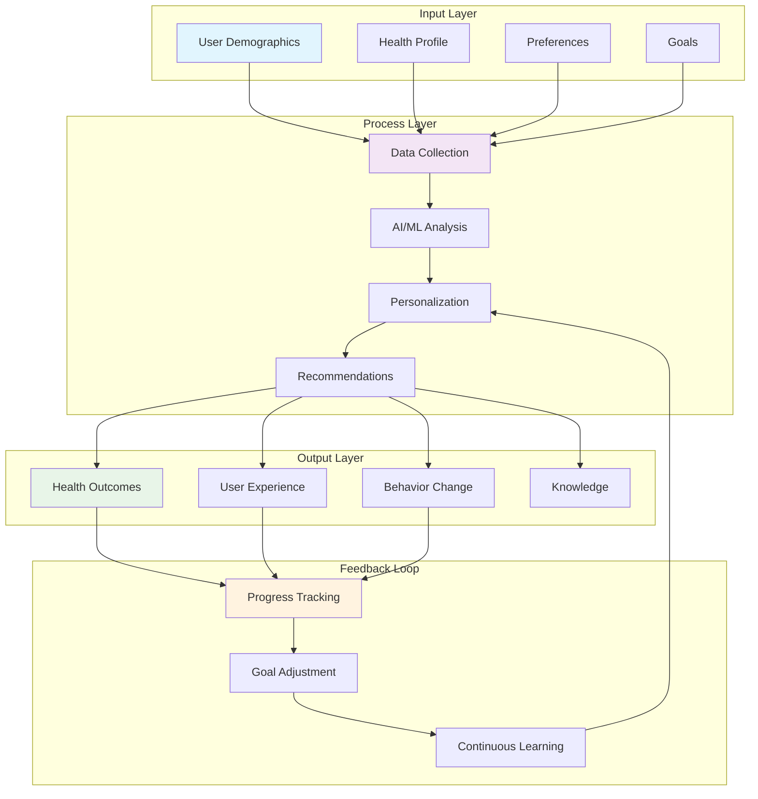

# Conceptual Framework for Nutrition App

## 1. Theoretical Foundation

### 1.1 Health Behavior Theories
- **Social Cognitive Theory (Bandura)**: User self-efficacy in nutrition management
- **Theory of Planned Behavior**: Intentions and behavior change in dietary habits
- **Health Belief Model**: Perceived benefits and barriers to healthy eating
- **Transtheoretical Model**: Stages of change in nutrition behavior

### 1.2 Nutrition Science Principles
- **Energy Balance**: Calories in vs. calories out
- **Macronutrient Balance**: Protein, carbohydrates, and fats
- **Micronutrient Requirements**: Vitamins and minerals
- **Personalized Nutrition**: Individual differences in nutritional needs

### 1.3 Technology Acceptance Model
- **Perceived Usefulness**: App's value in achieving nutrition goals
- **Perceived Ease of Use**: User-friendly interface and experience
- **Behavioral Intention**: User's intention to use the app
- **Actual Usage**: Real-world app adoption and engagement

## 2. Key Concepts and Variables

### 2.1 Input Variables (Independent Variables)

#### User Demographics
- Age
- Sex/Gender
- Height
- Weight
- Activity Level
- Health Goals

#### User Preferences
- Dietary Restrictions
- Food Preferences
- Cultural Background
- Lifestyle Factors

#### Health Factors
- Medical History
- Allergies
- Current Health Status
- Medications

### 2.2 Process Variables (Mediating Variables)

#### Data Collection
- Food Logging Frequency
- Data Accuracy
- User Engagement
- App Usage Patterns

#### Analysis and Processing
- Calorie Calculation
- Nutrition Analysis
- Goal Tracking
- Progress Monitoring

#### Personalization
- Algorithm Adaptation
- Recommendation Engine
- Goal Adjustment
- Feedback Systems

### 2.3 Output Variables (Dependent Variables)

#### Health Outcomes
- Weight Management
- Nutritional Intake
- Health Metrics
- Behavior Change

#### User Experience
- User Satisfaction
- App Retention
- Goal Achievement
- Knowledge Gain

#### System Performance
- Data Accuracy
- Response Time
- System Reliability
- User Adoption

## 3. Conceptual Model

## 4. Research Paradigm

### 4.1 Positivist Approach
- **Objective Reality**: Nutrition facts and health metrics
- **Quantitative Data**: Calorie counts, weight measurements, usage statistics
- **Causal Relationships**: Input → Process → Output relationships
- **Generalizable Results**: Applicable to broader user populations

### 4.2 Interpretivist Approach
- **Subjective Experience**: User perceptions and experiences
- **Qualitative Data**: User feedback, behavior patterns, preferences
- **Contextual Understanding**: Individual user contexts and motivations
- **Personalized Insights**: Tailored recommendations and experiences

## 5. Conceptual Relationships

### 5.1 Direct Relationships
1. **User Input → System Processing**: User data directly influences app functionality
2. **System Output → User Behavior**: App recommendations affect user actions
3. **Feedback → System Adaptation**: User responses modify system behavior

### 5.2 Moderating Relationships
1. **User Engagement**: Affects the strength of input-output relationships
2. **Data Quality**: Influences the accuracy of system recommendations
3. **Technology Literacy**: Impacts user adoption and effective usage

### 5.3 Mediating Relationships
1. **Personalization Engine**: Mediates between user input and system output
2. **Learning Algorithm**: Mediates between user behavior and system adaptation
3. **Feedback Mechanisms**: Mediate between system output and user input

## 6. Assumptions

### 6.1 User Assumptions
- Users want to improve their nutrition and health
- Users are willing to log their food intake
- Users have access to smartphones and internet
- Users can provide accurate personal information

### 6.2 System Assumptions
- AI/ML models can accurately predict nutrition values
- Personalization improves user engagement and outcomes
- Real-time feedback enhances user experience
- Data privacy and security are maintained

### 6.3 Technical Assumptions
- Mobile app provides sufficient functionality
- Backend systems can handle user load
- API integrations are reliable and accurate
- Data storage and retrieval are efficient

## 7. Limitations

### 7.1 User Limitations
- Self-reporting bias in food logging
- Varying levels of user commitment
- Different technological comfort levels
- Cultural and language barriers

### 7.2 System Limitations
- AI model accuracy depends on training data
- Limited food database coverage
- Real-time processing constraints
- Privacy and security concerns

### 7.3 Technical Limitations
- Mobile device compatibility issues
- Internet connectivity requirements
- Data storage and processing costs
- API rate limits and availability

## 8. Scope and Boundaries

### 8.1 Included in Scope
- Personal nutrition tracking and analysis
- Goal setting and progress monitoring
- Food logging and calorie counting
- Basic health recommendations
- User profile management

### 8.2 Excluded from Scope
- Medical diagnosis or treatment
- Professional nutritionist consultation
- Social media integration
- Advanced health monitoring devices
- Meal delivery services

## 9. Expected Outcomes

### 9.1 Short-term Outcomes
- Increased user awareness of nutrition
- Improved food logging habits
- Better understanding of calorie intake
- Enhanced user engagement with health goals

### 9.2 Long-term Outcomes
- Sustainable behavior change
- Improved health metrics
- Better nutrition knowledge
- Increased user retention and satisfaction

## 10. Success Metrics

### 10.1 User Engagement Metrics
- Daily active users
- Session duration
- Feature usage frequency
- User retention rates

### 10.2 Health Outcome Metrics
- Weight management success
- Calorie goal achievement
- Nutritional balance improvement
- User-reported health improvements

### 10.3 System Performance Metrics
- App response time
- Data accuracy rates
- System uptime
- User satisfaction scores

## 11. Implementation Framework

### 11.1 Development Phases
1. **Phase 1**: Core functionality (user registration, food logging)
2. **Phase 2**: AI/ML integration (nutrition prediction, recommendations)
3. **Phase 3**: Personalization (adaptive algorithms, goal tracking)
4. **Phase 4**: Advanced features (analytics, social features)

### 11.2 Evaluation Strategy
- **Formative Evaluation**: Continuous feedback during development
- **Summative Evaluation**: Final assessment of system effectiveness
- **User Testing**: Real-world testing with target users
- **Performance Monitoring**: Ongoing system performance tracking

This conceptual framework provides the theoretical foundation and systematic approach for developing, implementing, and evaluating the nutrition app system. 